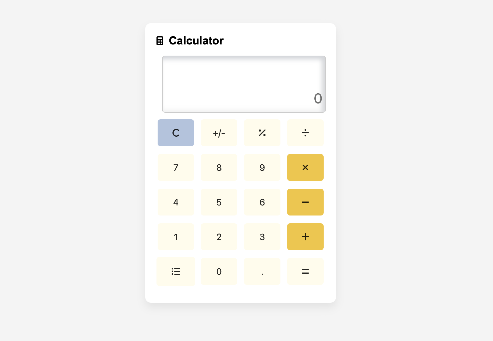

# 🧮 Calculator

## 💡 Description

This project is a **modern calculator** implementation in **JavaScript (ES2015+)**. It supports standard arithmetic operations and includes the flexibility to add creative features beyond typical calculators. The calculator not only performs as expected but also demonstrates solid UX/UI principles and extensibility for more advanced functions.

## 🛠 Features

### ✅ Basic Functionality
- **Arithmetic operations:** `+`, `-`, `×`, `÷`
- **Result:** Display current and final result
- **Percent `%`:** Compute percentage relative to current number
- **Reset `C`:** Clear/reset all values to default
- **Sign Toggle `+/-`:** Switch between positive and negative values
- **Decimal `.`:** Allows fractional number input
- **Factorial `x!`**
- **Exponentiation `xⁿ`**
- **Square root `√x`**
- **Memory operations:** `MR`, `MC`, `M+`, `M-`
- **Unit converters:**
  - Length: cm, m, km
  - Weight: g, kg, t
  - Area: cm², m², ha, km²
- **Numeral system conversions:** Binary, Decimal, Hexadecimal
- **Calculation history clipboard:** Copy/Paste history

### ⚙️ Behavior Specifications
- **Default output value:** `0`
- **Default history field:** Empty
- **Only numeric operations:** No string-based math
- **Real-time input/output:** Immediate feedback as operations are entered

## 🚀 How to Run

1. Clone the repository
2. Open `index.html` in your browser
3. Start calculating!

